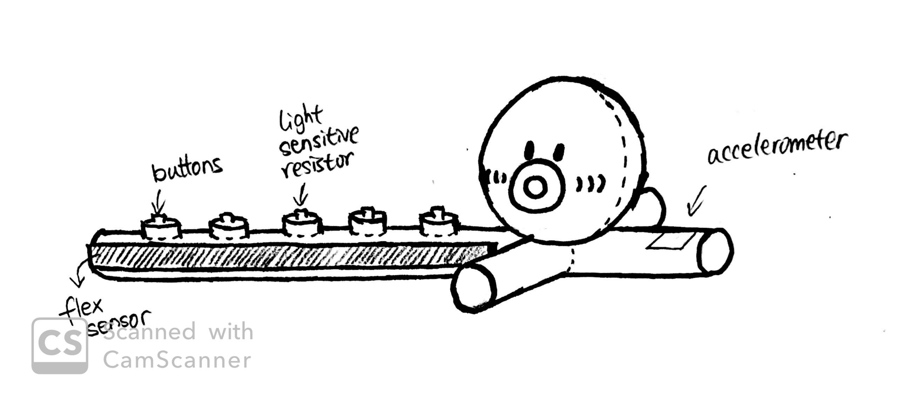

# IDD-final-project-Otakotone

## Project Idea: Otakotone
*After a couple iterations, we decided to create a simple music synthesizer and editor using Arduino with a visualization implemented through the Raspberry Pi*

Project name is inpired by the fun electronic music synthesizer [Otamatone](https://en.wikipedia.org/wiki/Otamatone) and Yuxin's avid love for tako (octopus).

## Team:
* Christine Ku (ECE)
* Yuxin Zhang (ECE)
* Fei Gao (CS)

## Paper Prototype:

#### Library we are using: 
[Mozzi](https://sensorium.github.io/Mozzi/) to generate algorithmic music on an arduino board

[Three.js](https://threejs.org/) for 3D object visualization

[Websocket.io](http://websocket.io/) for sending music data from arduino to raspberry pi

[Node.js](https://nodejs.org/en/) for backend webserver

## Expected Parts:
* Speaker
* Buttons
* Wires
* Arduino
* Raspberry Pi
* Potentiometer
* Accelerometer
* Flex Sensor
* Pressure Sensor
* Cardboard
* Breadboard

## Interaction Plan:
Upon connection, the arduino will output some sound signal. The user can interact with all the included sensors (details below) to modify and distort the sound emitted from the speaker. The user can also view a music visualization from the browser that interacts with user input in real-time.

#### Functions of sensors:
* Pitch
* Octaves
* FM Modulation
* Beats...
* almost had volume

## Functional Prototype:

We first created our synthesizer using a breadboard in order to make sure the functionality was there. The images below show the breadboard circuitry for testing the sensors and the Mozzi library separately.

We ran into a couple issues with some of the combinations of sensors with the Mozzi library. For example, the photoresistors created a sort of hang in the serial reading, so we decided to do without it. Furthermore, for the accelerometer although it worked when testing all the sensors at once, the Mozzi library used the same internal timer, so the LIS3DH would not be able to be accessed without using a separate Arduino board. Below, we have a video of our breadboard below:
[insert video here]

## Housing:

